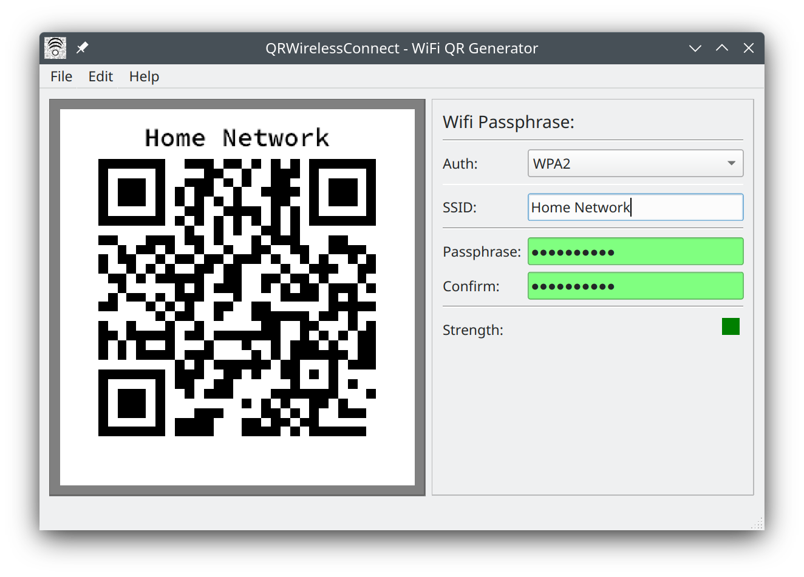

# QRWirelessConnect - WiFi QR Generator

Author: Aaron Mizrachi (unmanarc) <aaron@unmanarc.com>   
License: GPLv3   

This program is a software application designed to generate QR codes containing WiFi connection information. The program allows users to easily create QR codes that can be scanned by smartphones or tablets to automatically connect to a wireless network.

This program is useful for individuals and organizations that frequently set up wireless networks and want to make the connection process as simple and convenient as possible for their users. It also can be used as a marketing tool, allowing companies to easily share their WiFi information with customers via a QR code.

## Features

- Easy input of network name (SSID) and password
- Generates QR codes in a format recognized by most QR code scanning apps
- Save the generated QR code as a PNG image
- Print the QR code directly from the application
- Input validation to avoid common mistakes

## Requirements

- Qt framework 
- C++ compiler

## Usage

1. Input the necessary information, such as the network name (SSID) and password.
2. The program will automatically generate a QR code that encodes this information in a format that is recognized by most QR code scanning apps.
3. Save the generated QR code as a PNG image, and/or print it or share it.

## Disclaimer

- This software is provided 'as-is', without any express or implied warranty. In no event will the authors be held liable for any damages arising from the use of this software.
- **WARNING:** Please be aware that by sharing or printing the generated QR code, anyone who sees the code will be able to easily connect to the network and potentially access sensitive information. We recommend that you only share the QR code with trusted individuals and that you change the password for the network on a regular basis for security purposes.
